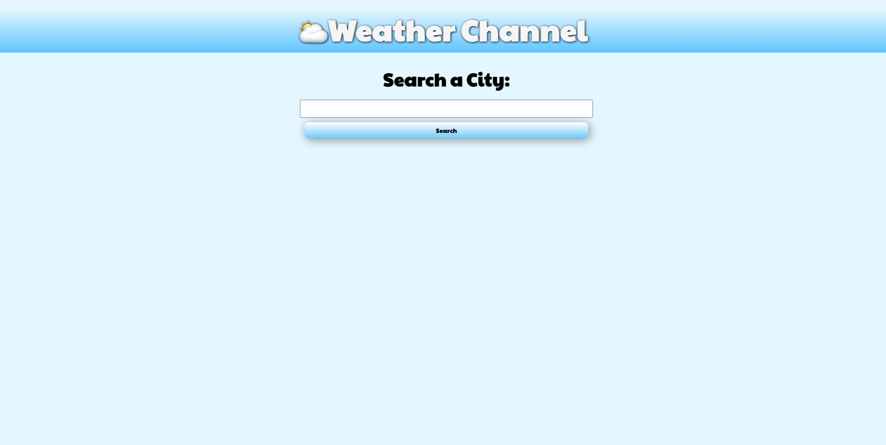
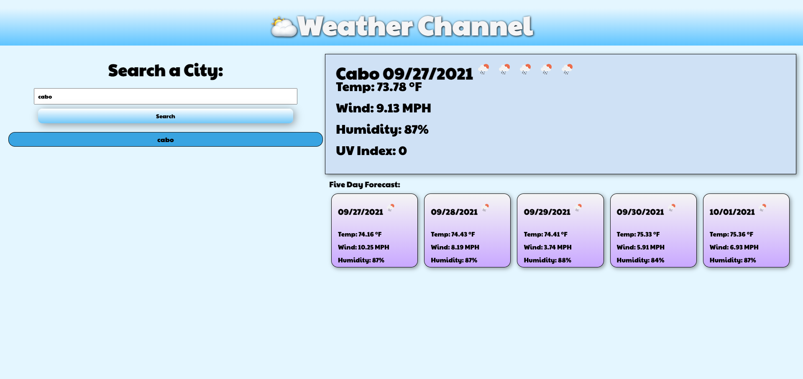
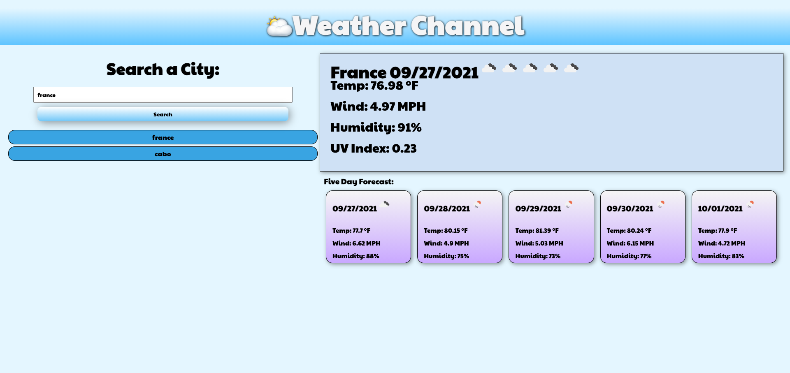
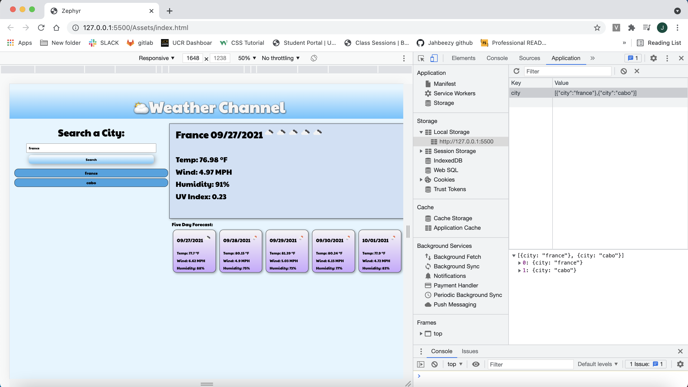

# Zephyr

## Description
---
    For this Project I needed to create a program that could display the weather forecast to plan trips accordingly. My weather channel allows you to easily search the name of a city from anywhere around the world. The weather conditions such as wind, humidity, temperature and UV will be displayed. Below that a five day forecast is shown. The data was grathered with a weather API and multiple fetch calls to target specific data. After that I used js to dynamically generate elements to store the fetch data in. The searches are stored in the local data and are displayed underneath the search bar. I learned how to make a much more interactive webpage that can access API data.

## Installation

To install this application go to https://github.com/Jahbeezy/Zephyr and copy the SSH key and clone it to your terminal.

## Usage

Go to https://jahbeezy.github.io/Zephyr/ and focus on the input box. Type in a city then click the search button. You will be presented with the current temperature, wind, humidity and UV reading. Below that will be a five day forecast. You can then search another city after. Searches are saved into local storage and displayed on the page.

## Credits

Carlos Hernandes

https://developer.mozilla.org/en-US/

https://www.w3schools.com/

## Liscence

    MIT License

    Copyright (c) [year] [fullname]
    
    Permission is hereby granted, free of charge, to any    person obtaining a copy
    of this software and associated documentation files (the    "Software"), to deal
    in the Software without restriction, including without  limitation the rights
    to use, copy, modify, merge, publish, distribute,   sublicense, and/or sell
    copies of the Software, and to permit persons to whom the   Software is
    furnished to do so, subject to the following conditions:
    
    The above copyright notice and this permission notice   shall be included in all
    copies or substantial portions of the Software.
    
    THE SOFTWARE IS PROVIDED "AS IS", WITHOUT WARRANTY OF ANY   KIND, EXPRESS OR
    IMPLIED, INCLUDING BUT NOT LIMITED TO THE WARRANTIES OF     MERCHANTABILITY,
    FITNESS FOR A PARTICULAR PURPOSE AND NONINFRINGEMENT. IN    NO EVENT SHALL THE
    AUTHORS OR COPYRIGHT HOLDERS BE LIABLE FOR ANY CLAIM,   DAMAGES OR OTHER
    LIABILITY, WHETHER IN AN ACTION OF CONTRACT, TORT OR    OTHERWISE, ARISING FROM,
    OUT OF OR IN CONNECTION WITH THE SOFTWARE OR THE USE OR     OTHER DEALINGS IN THE
    SOFTWARE.
    